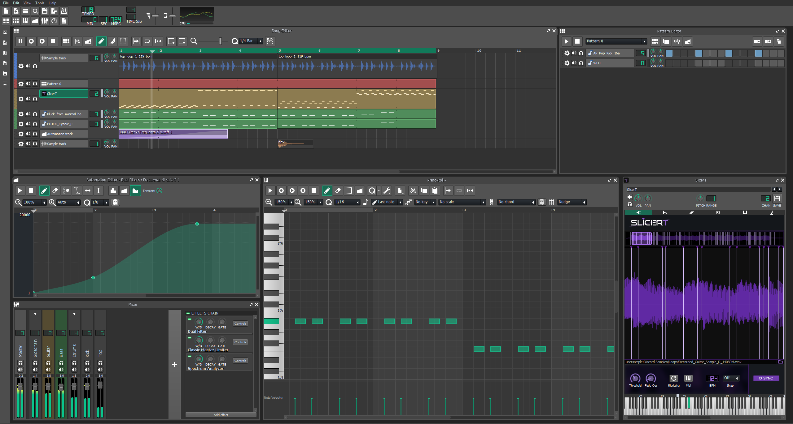
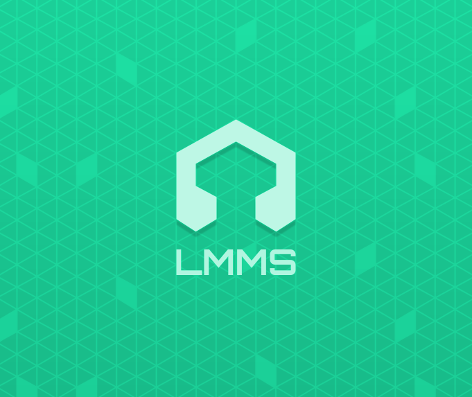

# LMMS Light Theme
A light lmms theme based on Budislav redesign concept, shown in https://github.com/LMMS/lmms/issues/1911

## Compatibility
This theme is compatible with LMMS nightly 1.3 versions. It is not compatible with the current stable 1.2. Note that, as nightly is continuously undergoing development, some parts of it may be broken due to future changes.

*Note*: this theme only contains the edited/newly created assets and style css file. A lot of assets fallback to the `default` theme ones, so you still need to have it for this to work properly. If you really want to, you can get it completely independent by merging the two of them manually.

## Usage
Download the source code as .zip, extract it, then put the `light` folder inside your LMMS theme folder.
To apply it to LMMS, select the `light` folder from LMMS settings and restart the program.

# License
This derivative work off of LMMS default theme, therefore it's licensed GPLv2. That said, i personally crafted some new assets, therefore if you plan on modifying it, a mention to the original project would be nice.

